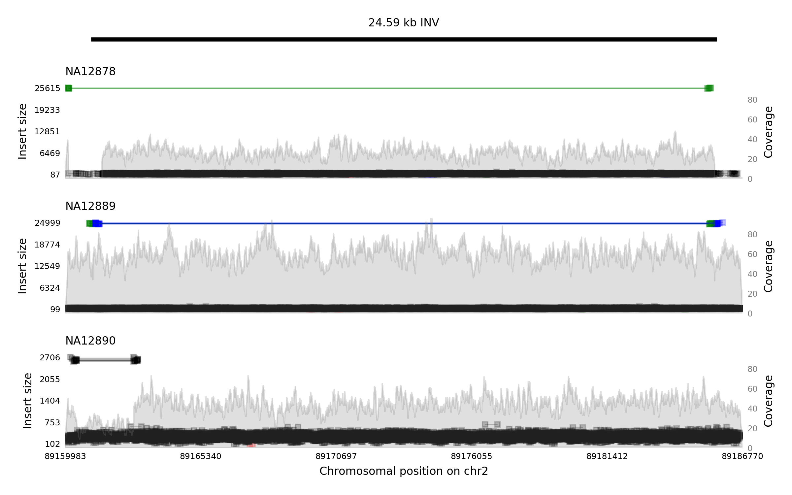
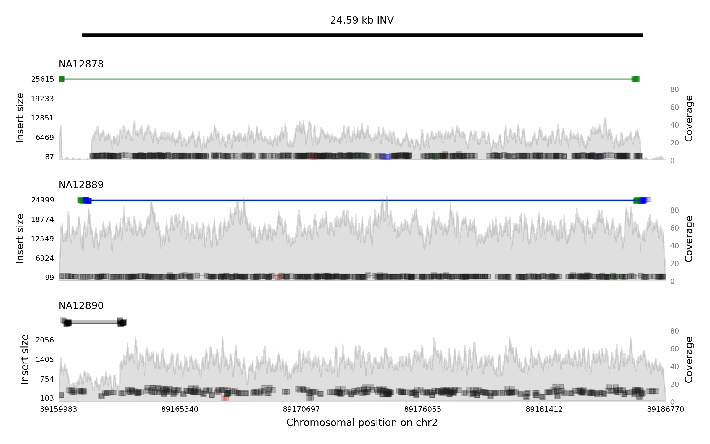

# samplot

Creates image views of genomic intervals from read alignment files, optimized for structural variant viewing.

Samplot workflow is simple. Clone this repository and ensure that you have Python 2.7.X (samplot does not currently support Python 3.XX). Also make sure you have the following python libraries:

* numpy
* matplotlib
* pylab
* pysam
* statistics

All of these are available with [pip](https://pypi.python.org/pypi/pip).

## Usage Examples: 


### Basic use case
We're  using data from NA12878, NA12889, and NA12890 in the [1000 Genomes Project](http://www.internationalgenome.org/about). 

Let's say we have BAM files and want to see what the inversion in NA12878 at 2:89161083-89185670 looks like. 
The following command will create an image:
```
python src/samplot.py -c chr2 -s 89161083 -e 89185670 -b \
test/data/high_coverage/NA12878_S1.restricted_sv_regions.bam,test/data/high_coverage/NA12889_S1.restricted_sv_regions.bam,test/data/high_coverage/NA12890_S1.restricted_sv_regions.bam \
-o img/hi_2_89161083_89185670.png -n NA12878,NA12889,NA12890 -t INV
```



### Basic use case with sampling
That took 1m23.766s to generate. To speed things up, we'll use the -d flag to set the sampling depth at 200 reads from the region we're interested in.
```
python src/samplot.py -c chr2 -s 89161083 -e 89185670 -b \
test/data/high_coverage/NA12878_S1.restricted_sv_regions.bam,test/data/high_coverage/NA12889_S1.restricted_sv_regions.bam,test/data/high_coverage/NA12890_S1.restricted_sv_regions.bam \
-o img/hi_2_89161083_89185670_200reads.png -n NA12878,NA12889,NA12890 -t INV -d 200
```


Generated in 0m3.632s and it looks pretty good. Read sampling will only filter out 'normal' reads - splitters, discordants and read depth track will still appear.


### CRAM inputs
Samplot also support CRAM input, which requires a reference fasta file for reading. For example:

```
```
