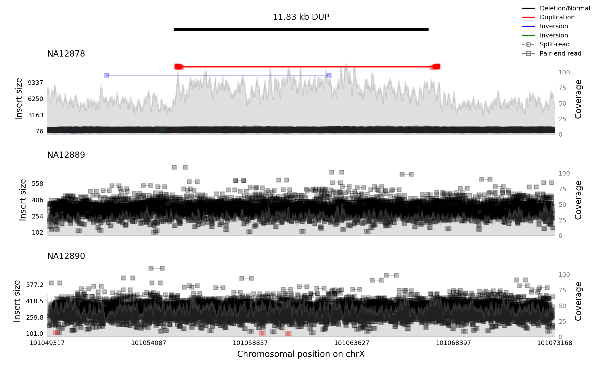

# samplot

Creates image views of genomic intervals from read alignment files, optimized for structural variant viewing.

Samplot workflow is simple. Clone this repository and make sure you have the following python libraries:

* numpy
* matplotlib
* pylab
* pysam
* statistics

All of these are available from [pip](https://pypi.python.org/pypi/pip).

Samplot requires either BAM files or CRAM files as primary input (if you use CRAM, you'll also need a reference genome like one used the the 1000 Genomes Project (ftp://ftp-trace.ncbi.nih.gov/1000genomes/ftp/technical/reference/human_g1k_v37.fasta.gz). Follow the usage examples below to format your commands.

## Usage Examples: 


### Basic use case
We're  using data from NA12878, NA12889, and NA12890 in the [1000 Genomes Project](http://www.internationalgenome.org/about). 

Let's say we have BAM files and want to see what the deletion in NA12878 at 4:115928726-115931880 looks like compared to two other samples (NA12889, NA12890). 
The following command will create an image of that region:
```
python Samplot/src/samplot.py -n NA12878,NA12889,NA12890 -b Samplot/test/data/NA12878_restricted.bam,Samplot/test/data/NA12889_restricted.bam,Samplot/test/data/NA12890_restricted.bam -o 4_115928726_115931880.png -s 115928726 -e 115931880 -c chr4 -t DEL
```

The arguments used above are:

`-n` The names to be shown for each sample in the plot

`-b` The BAM/CRAM files of the samples (comma-separated)

`-o` The name of the output file containing the plot

`-s` The start location of the region of interest

`-e` The end location of the region of interest

`-c` The chromosome of the region of interest

`-t` The type of the variant of interest

This will create an image file named `4_115928726_115931880.png`, shown below:


### Generating images from a VCF file
To plot images from all structural variants in a VCF file, use samplot's `samplot_vcf.sh` script. This accepts a VCF file and the BAM files of samples you wish to plot, outputing images and related metadata to a directory of your choosing.

This script is especially useful as part of the [SV-plaudit pipeline](https://github.com/jbelyeu/SV-plaudit) and creates metadata files for all images which SV-plaudit requires.

```
bash Samplot/src/samplot_vcf.sh -o output_dir -B /Users/jon/anaconda/bin/bcftools -S Samplot/src/samplot.py -v Samplot/test/data/NA12878.trio.svt.subset.vcf Samplot/test/data/NA12878_restricted.bam Samplot/test/data/NA12889_restricted.bam Samplot/test/data/NA12890_restricted.bam
```
The arguments used above are:

`-o` output directory (make this directory before executing)

`-B` Executable file of [bcftools](https://samtools.github.io/bcftools/)

`-S` samplot.py script

`-v` VCF file with variants to plot


#### CRAM inputs
Samplot also support CRAM input, which requires a reference fasta file for reading as noted above. Notice that the reference file is not included in this repository due to size. This time we'll plot an interesting duplication at X:101055330-101067156.

```
python Samplot/src/samplot.py -n NA12878,NA12889,NA12890 -b Samplot/test/data/NA12878_restricted.cram,Samplot/test/data/NA12889_restricted.cram,Samplot/test/data/NA12890_restricted.cram -o cramX_101055330_101067156.png -s 101055330 -e 101067156 -c chrX -t DUP -r ~/Research/data/reference/hg19/hg19.fa
```

The arguments used above are the same as those used for the basic use case, with the addition of the following:

`-r` The reference file used for reading CRAM files


And the image is again below:

